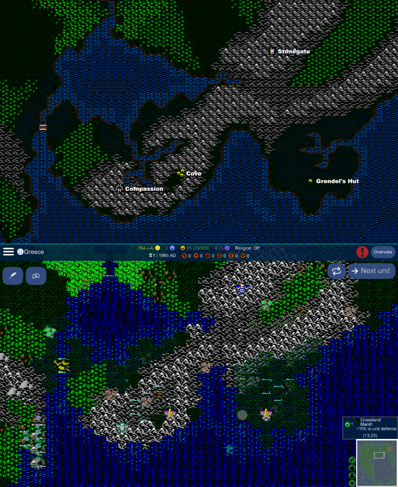
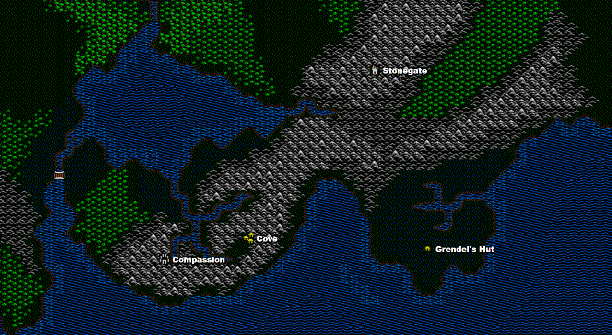

# UltimaV-tileset
Tileset graphics mod for Ultima V map [Britannia](https://github.com/hackedpassword/Nextgen-Maps#britannia-overworld), and a component of the (wip) U5 mod.

For a comparison, here's the original graphics:

I love this map! Credit to the author @drrak. The whole map is [here](https://drrak.github.io/ultima5/).

What should stand out the most is that you don't see hex tiles, only "square" tiles. This is an intended and tricky effect to mimic the original looks of the 1988 game.

There's a slight intermix of sprite tilesets, mostly PC version. I wanted to use the Apple ][e version but those sprites are far too low quality, maybe in another tileset.

It's only the beginning. Give this mod a star :star: if you like the retro concept!
